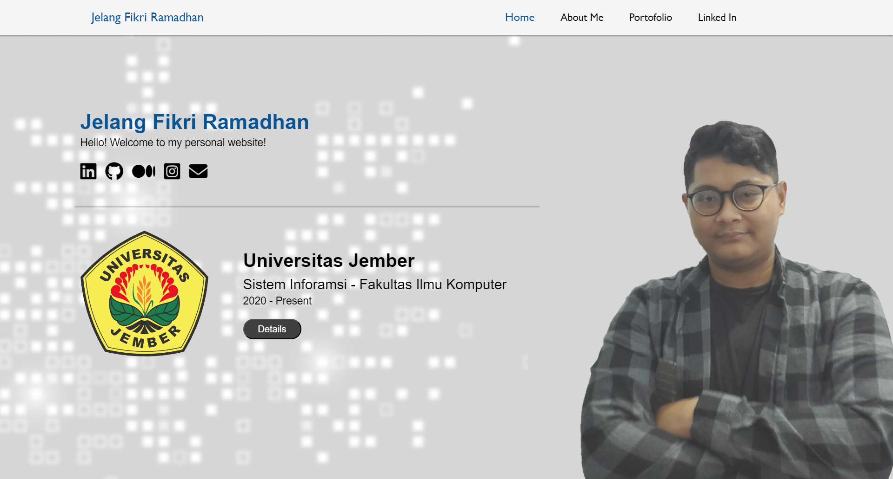
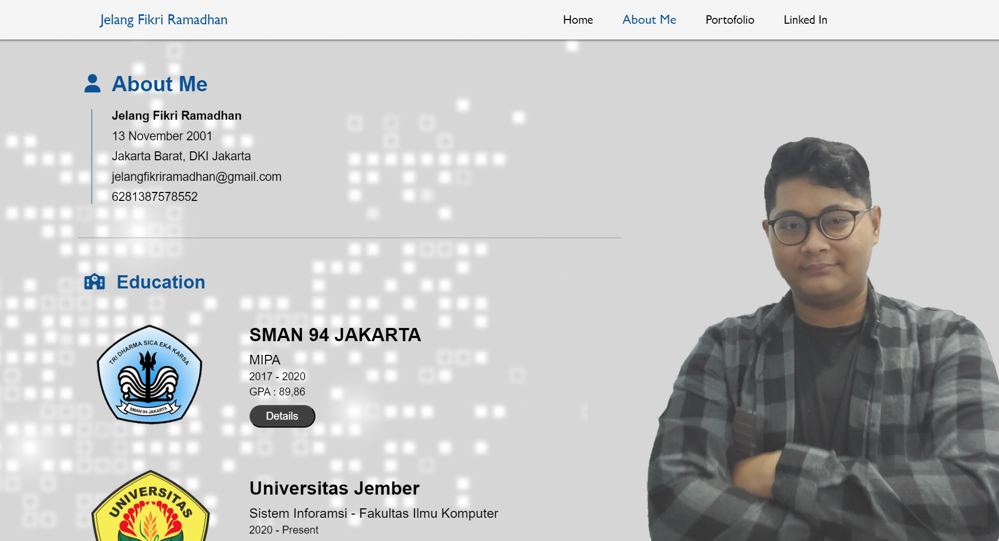
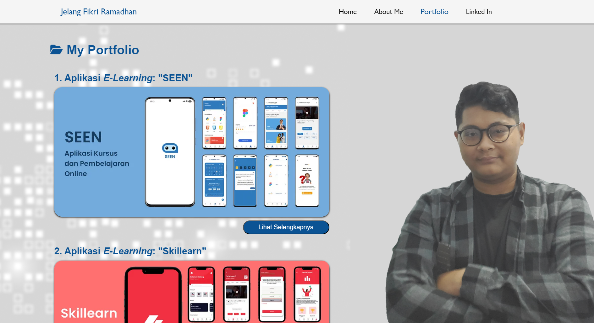
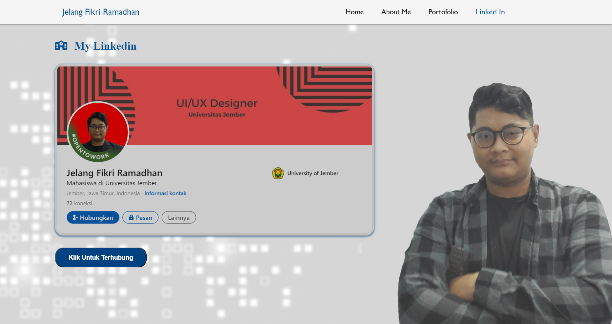

# Tugas Skilvul #Tech4Impact Kampus Merdeka Cycle 4: Front-End Web Development 

## Technical Project Assignment (TPA) #1 - Personal Website

> Membuat personal website menggunakan HTML dan CSS (Flexbox atau Grid), mengupload ke dalam repository, dan mendeploy ke dalam hosting (Netlify atau vercel).

----------
## Tugas

- Buatlah website personal menggunakan `HTML` dan `CSS`
- Gunakan beberapa teknik CSS seperti `Flexbox` atau `Grid`
- Halaman website minimum terdiri dari 4 halaman yaitu:
    - Homepage
    - About Page
    - Portfolio Page/Skills Page
    - Blog/Articles Page
- Konten dan desain bersifat fleksibel mengikuti kreatifitas dan kebutuhan peserta
- Publish source code yang telah dibuat pada Repository GitHub
- Deploy aplikasi website menggunakan Netlify atau Vercel dan integrasikan dengan Repository GitHub
- Pastikan Repository GitHub dan Link Website dapat diakses secara publik

----------
## Bahasa Pemrograman
- HTML
- CSS
- Javascript

----------
## Netlify Link
[Personal Website](https://jelangfikriramadhan.netlify.app/)

----------
## Preview

1. Homepage

2. About Me

3. Portfolio

4. Linked In

